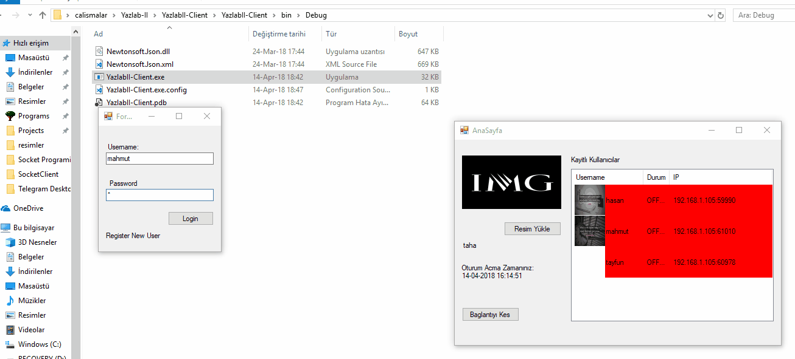
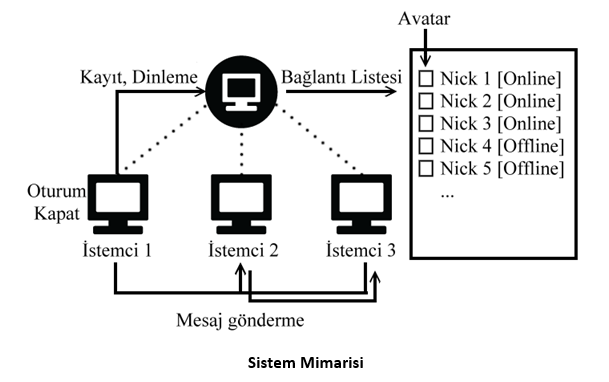

# BLM306 YAZILIM LABORATUVARI II PORJE 2

## MESSENGER UYGULAMASI

### Ekran Görüntüsü

### Projenin Amacı:

Sunucu-istemci mimarisini kullanarak, istemciler arasında anlık mesajlaşma işleminin yapılması.

### Sistem Mimarisi**

**Yapılması Gerekenler:**

- 1. [ZORUNLU] Kayıt ve dinleme (20 Puan): İstemciler sunucuya &quot;Nick&quot;,&quot;IP&quot; bilgileri ile kayıt olacaklardır (Veri tabanına gerek yok). Kayıt olan istemciler listede [Online] / [Offline] etiketi ile gösterileceklerdir.

- 2. Bağlantıyı kes (10 puan): Oturumu kapat butonu ile İstemciler sunucu ile bağlantıyı koparabileceklerdir.

- 3. 15 sn periyotlarla sunucu tarafından oturum kontrolünün yapılması (10 puan): Sunucu kendisine bağlı olan istemcileri 15 sn aralıklarla kontrol ederek listede [Online]/[Offline] durum güncellemesini yapacaktır.

- 4. Mesajlaşmak istenen istemciler arasında izin kontrolü (10 puan): İstemcilerden biri herhangi başka bir istemciye mesaj göndermek istediğinde karşı taraftan onay alması gerekmektedir. Bu onay mesajı izin istenen istemcide uyarı mesajı şeklinde gözükmesi gerekmektedir.

- 5. Mesaj gönderme (30 puan): Bağlantı isteği kabul edilir ise istemciler arasında text mesajların gönderilmesi sağlanmalıdır. Hangi istemcinin hangi mesajı gönderdiği ayırt edilebilir olması gerekmektedir. Mesaj gönderme işlemi sadece iki istemci arasında olması gerekmektedir. Sunucuya bağlı diğer istemcilere aynı mesajların gönderilmemesi gerekir. Örneğin; istemci 1 den istemci 2 ye herhangi bir mesaj gönderilecekse istemci 3 ün bu mesajı görmemesi gerekir.

- 6. [ZORUNLU] Rapor (20 puan): 5. Maddede istenenler yapılmadıysa rapor 10 puan üzerinden değerlendirilecektir.

- 7. BONUS: İstemciler sunucuya kayıt olurken kullanıcıya ait avatar resmini sunucuya göndermesi ve listede göstermesi halinde projesine 10 puan eklenecektir.
